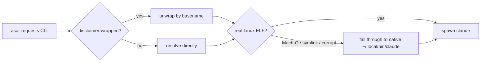

<div align="center">

# Claude Cowork for Linux &mdash; v4.1.0

### &ldquo;The 127 Release&rdquo; &middot; cowork sessions actually start now

[](https://github.com/johnzfitch/claude-cowork-linux/releases/tag/v4.1.0)
[](https://github.com/johnzfitch/claude-cowork-linux/blob/v4.1.0/COMPAT.md)
[](https://github.com/johnzfitch/claude-cowork-linux)

[Highlights](#highlights) &middot; [Upgrade](#upgrade) &middot; [What&rsquo;s fixed](#whats-fixed) &middot; [Verify](#verify-your-build) &middot; [Internals](#under-the-hood)

</div>

---

> [!IMPORTANT]
> If your cowork sessions died the instant they started &mdash; the dreaded <samp>Claude Code process exited with code 127</samp> &mdash; **this is the release that fixes it.** Two separate bugs were both ending sessions with `127`; both are gone now.

## Highlights

- &#10003; **Cowork sessions start again.** The binary resolver *and* the `Helpers/disclaimer` wrapper were each producing exit `127`; both fixed.
- &#10003; **Pin &amp; verify a known-good Desktop build.** [`COMPAT.md`](https://github.com/johnzfitch/claude-cowork-linux/blob/v4.1.0/COMPAT.md) now records the exact Anthropic <abbr title="Content Delivery Network">CDN</abbr> URL **and** a verified `SHA-256` for the last tested asar &mdash; no more hunting for a working version.
- &#10003; **No more launch crash** on newer asar builds that call `app.configureWebAuthn()`.
- &#10003; **Symlinks banned** in CLI resolution &mdash; real, executable Linux paths only.
- &#10003; **Opt-in bwrap sandbox** for the spawned CLI, plus an installer escape hatch for untested versions.

## Upgrade

```sh
cd ~/.local/share/claude-desktop && git pull && bash install.sh --update
```

> [!TIP]
> On a clean install you no longer need to `chmod +x` the `Helpers/disclaimer` shim by hand &mdash; the installer sets the executable bit for you now.

## What&rsquo;s fixed

| Area | Issue | Commit | Summary |
|:--|:--:|:--:|:--|
| Cowork spawn | #132 | `e09e83b` | Disclaimer wrapper unwraps the Claude CLI by basename instead of running the `exit 127` stub |
| Cowork spawn | #132 | `bf4f5cf` | Disclaimer shim is created executable (the asar pre-checks it with `access(X_OK)`) |
| Binary resolution | #132 | `8ad9bd7` | Reject Mach&#8209;O / symlink / corrupt entries; resolve a real Linux <abbr title="Executable and Linkable Format">ELF</abbr> |
| Tested versions | #122 | `48acf4a` | Pinned CDN URL + verified checksum, with a verify&#8209;then&#8209;install flow |
| Launch crash | #128 | `26aa979` | No&#8209;op stub for the macOS&#8209;only `app.configureWebAuthn()` |

## Verify your build

The last tested Desktop build is pinned with a checksum you can confirm yourself:

<dl>
  <dt>asar version</dt>
  <dd><code>1.6259.1</code></dd>
  <dt>SHA&#8209;256</dt>
  <dd><code>98c9de8dde01f083b73e7ef08cfaf7adfd2c1386e88d2995b4202dea1a31e898</code></dd>
</dl>

<details>
<summary>Download &amp; verify (straight from Anthropic&rsquo;s CDN)</summary>

```sh
curl -fL -o Claude-1.6259.1.dmg \
  "https://downloads.claude.ai/releases/darwin/universal/1.6259.1/Claude-5095e7dddcba4ca974d351ee397e17d204814f07.dmg"
sha256sum Claude-1.6259.1.dmg
# expect: 98c9de8dde01f083b73e7ef08cfaf7adfd2c1386e88d2995b4202dea1a31e898
CLAUDE_ARCHIVE="$PWD/Claude-1.6259.1.dmg" bash install.sh
```

</details>

> [!NOTE]
> This project never hosts or redistributes the Desktop archive. The line above is a pointer to Anthropic&rsquo;s own CDN plus a fingerprint &mdash; the same source `--update` already pulls from.

## Under the hood

<details>
<summary>Why cowork sessions exited 127 (two layers)</summary>

<br>

On macOS the asar runs commands through a `Helpers/disclaimer` wrapper. Because we spoof `darwin`, that path activates on Linux too. We ship the wrapper as a fail&#8209;closed stub &mdash; literally `#!/bin/sh` then `exit 127` &mdash; and rely on intercepting the spawn to swap in the real command.

**Layer 1 &middot; `e09e83b`.** A capability&#8209;registry refactor[^ocap] narrowed the unwrap to *only* the macOS `claude.app/.../Claude` path. Every other path the asar uses for the CLI was rejected, the unwrap returned `null`, and the spawn fell through to the stub &rarr; <samp>exit 127</samp>. The fix recognizes the CLI by basename and maps it to **our** resolved binary &mdash; never the caller&rsquo;s path, so it grants no new privilege.

**Layer 2 &middot; `bf4f5cf`.** The stub was written `0o444` (non&#8209;executable), but the asar pre&#8209;checks it with `access(X_OK)` before invoking &mdash; so on a clean install it failed *before* Layer 1 even mattered (hence the manual `chmod +x` some people needed). It&rsquo;s now created `0o555`, still fail&#8209;closed.

</details>

<details>
<summary>How CLI resolution works now</summary>

<figure>



<figcaption>Resolution rejects non&#8209;runnable entries and never trusts a symlink.</figcaption>
</figure>

</details>

## Thanks

Big thanks to **@elvanor** for the meticulous `--doctor` output and the `Helpers/disclaimer` clue that cracked #132, and for confirming the pinning approach on #122.

---

<div align="center">

[Commit history](https://github.com/johnzfitch/claude-cowork-linux/commits/v4.1.0) &middot; [COMPAT.md](https://github.com/johnzfitch/claude-cowork-linux/blob/v4.1.0/COMPAT.md) &middot; [Report an issue](https://github.com/johnzfitch/claude-cowork-linux/issues/new/choose)

</div>

[^ocap]: The object&#8209;capability (OCap) registry in `f41417e` replaced loose directory allowlists with a frozen capability set &mdash; good for security, but it tightened the disclaimer unwrap too far. v4.1.0 keeps the registry and its posture; it just teaches the unwrap to recognize the Claude CLI again.
